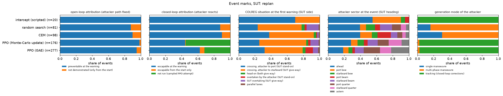
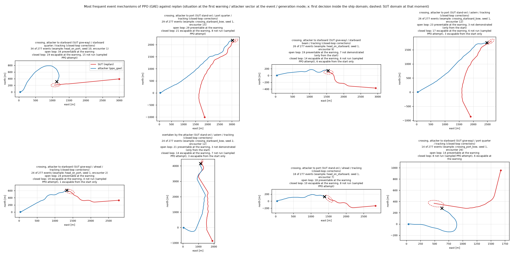

# Event marking: how the attacker generates events, and which events the system under test could have prevented

Date: 2026-10-08. Code: `general/event_labels.py` (new), `general/study_compare.py` (records every event), `general/scenario_targets.py` (`TargetShip.set_override`). Runs: `Desktop/PPO_scenario_generate/runs/study_2026-10-08/compare_rec/` (the comparison of `STUDY_RUNS_2026-10-08.md` re-run with event recording) and `labels/`.

This record implements item 7 of `STUDY_PLAN_PEER_REVIEW.md`: every failure an attacker induces is replayed and marked, so that a failure count can be read as a set of events with a known situation, a known generation mechanism and a known attribution. It also answers whether the current attacker can generate complex events.

## 1. What is recorded

`study_compare.py run` now writes, next to each result file, `<method>_s<seed>.events.jsonl`: per encounter the attacker's action sequence of the induced failure (`kind = event`), or of the closest approach when the method induced none (`kind = closest`). The environment is deterministic, so a sequence replays the event exactly; `replay_ok` checks this for every entry.

## 2. Labels

All labels take the side of the system under test (SUT); bearings are measured from the SUT's heading, positive to port.

| label | values | definition |
|---|---|---|
| event type | collision, domain infringement | collision when severity 3 was reached, otherwise a ship-domain infringement held for two decisions |
| COLREG situation at the first warning | head-on, crossing (attacker on the SUT's starboard side), crossing (attacker on the port side), overtaken, overtaking, parallel | `encounter_standard.encounter_type` with the SUT as own ship, at the first decision with a CPA warning |
| SUT role | give-way, stand-on, both, none | Rules 13 to 15 for that situation |
| situation at the event | as above | at the first decision with severity >= 2 |
| sector | ahead, bow, beam, quarter (port or starboard), astern | attacker bearing at the event; boundaries 22.5, 67.5, 112.5 and 157.5 deg |
| closing | fast, moderate, slow | relative speed at the event against the cruise speed (>= 1, >= 0.5, below) |
| SUT state | evading, route | the SUT executing an avoidance alteration at the event or following its route |
| generation mode | direct, single, multi-phase, tracking | from the attacker's commands up to the event: no turn and no speed change; one turn segment; two or three turn segments or turn and speed change in separate phases; four or more turn segments (continuous closed-loop correction) |
| response lift | number | rate of turns toward the SUT within two decisions after a SUT course change (> 5 deg in one decision) minus the rate at all other decisions; about 0 for a pure pursuer and for an open-loop plan, above 0 for an attacker that answers the SUT's manoeuvres |
| open-loop attribution | preventable, not demonstrated, initially infeasible | plan item 7 as written, section 3 |
| closed-loop attribution | escapable, escapable from the start, inescapable, not run | section 3 |
| adaptive failure | 0 / 1 | preventable in open loop and not escapable in closed loop |
| mark | text | situation at the warning / sector / closing / generation mode / open-loop attribution / closed-loop attribution |

## 3. Attribution by counterfactual replay

The SUT follows its preset until t0, then performs one manoeuvre of a library and keeps it: course change 0, +-30, +-60 or +-90 deg from its heading at t0 (+ to port) combined with speed 0 (stop), 0.5 or 1.0 of cruise, within its turn rate and an acceleration of +-0.1 m/s^2. That makes 21 manoeuvres. t0 is either the first CPA warning or the scenario start. A speed increase is left out: in the study the attacker's top speed equals the SUT's cruise speed, so any increase escapes trivially.

**Open loop (as the plan specifies).** The attacker's recorded actions replay unchanged; its kinematics do not depend on the SUT, so its path is the recorded one. After its last recorded action it holds course and speed, and the check runs until the recorded event time + 60 s.
- *preventable*: at least one manoeuvre started at the first warning avoids the failure;
- *not demonstrated*: none started at the warning does, at least one started at the scenario start does;
- *initially infeasible*: none from either time.

Two companion flags: *hold avoids* (holding course and speed from the warning avoids the failure, so the SUT's own alterations took part in it) and *COLREG prevention* (an avoiding manoeuvre at the warning with a starboard or no course change exists).

**Closed loop (added).** An attacker that steers in closed loop shapes its path on the SUT's actual manoeuvres. Against a frozen copy of that path almost any other SUT behaviour escapes, so the open-loop label mostly says that the SUT's own manoeuvre was exploited. The closed-loop replay lets the attacker's policy react to the counterfactual SUT and runs to the end of the encounter: the PPO policy with argmax actions, the scripted intercept or pursuit, and for random search and CEM the open-loop plan itself, which is their whole policy.
- *escapable*: some manoeuvre at the warning avoids the failure against the reacting attacker;
- *escapable from the start*: only a manoeuvre from the scenario start does;
- *inescapable*: none does.

PPO events found by a sampled attempt (attempt > 1) come from a stochastic policy and are marked *not run* in closed loop.

## 4. Results

### 4.1 Reproduction

The comparison of `STUDY_RUNS_2026-10-08.md` was re-run with recording (152 jobs, 47 min on 20 workers). All 7296 encounter records (4 SUTs, every method and seed, 48 held-out encounters) are identical to the original run in found, first attempt, attempts, transitions, sub-steps, collision, closest distance and target evasions. Every one of the 7296 recorded sequences (5113 induced events, 2183 closest approaches) replays to its recorded outcome (`replay_ok` = 1.000). The labels below therefore describe exactly the events behind the study's numbers.

### 4.2 What the events are

Against `replan` (the one SUT that is not saturated); shares of each method's events:

| method | events | collision | attacker in the SUT's stern sector at the event | attacker ahead | SUT evading at the event |
|---|---|---|---|---|---|
| intercept (scripted) | 20 | 0.50 | 0.00 | 0.55 | 1.00 |
| random search | 81 | 0.05 | 0.21 | 0.40 | 1.00 |
| CEM | 98 | 0.19 | 0.14 | 0.40 | 0.97 |
| PPO (Monte-Carlo update) | 176 | 0.11 | 0.39 | 0.28 | 0.95 |
| PPO (GAE) | 277 | 0.09 | 0.56 | 0.19 | 0.97 |

Stern sector = astern or either quarter (more than 112.5 deg from the SUT's heading).

- The SUT had detected the danger and was executing an avoidance alteration in 95 to 100 % of the events against `replan`; the failures happen during its avoidance, without exception.
- COLREG situation at the first warning, PPO (GAE): crossing with the attacker to starboard (SUT give-way) 0.47, to port (SUT stand-on) 0.32, overtaken by the attacker (SUT stand-on) 0.09, SUT overtaking 0.06, head-on 0.04, parallel 0.02. Random search has more SUT-overtaking situations (0.15), the intercept mostly crossings with the attacker to port (0.70).
- PPO's signature is the approach from the SUT's stern sector: 0.56 of its events against `replan` (astern 0.22, port quarter 0.20, starboard quarter 0.14), against 0.14 to 0.21 for random search and CEM and none for the intercept. The scripted and open-loop attackers meet the SUT from ahead or the bow.
- PPO's failures are mostly ship-domain infringements (collision share 0.09); the intercept, which aims at the SUT's position, collides in half of its events.

Against the weak SUTs the PPO events come most often from ahead (0.36 to 0.65 of them) and only rarely from the stern sector (0.02 to 0.14), with collision shares 0.22 to 0.42.

### 4.3 How the attacker generates them

| SUT | method | tracking | multi-phase | single | direct | response lift |
|---|---|---|---|---|---|---|
| replan | PPO (GAE) | 0.97 | 0.03 | 0.00 | 0.00 | +0.08 |
| replan | PPO (Monte-Carlo) | 0.98 | 0.02 | 0.00 | 0.00 | +0.03 |
| replan | intercept | 1.00 | 0.00 | 0.00 | 0.00 | +0.51 |
| replan | random search | 0.00 | 0.84 | 0.16 | 0.00 | -0.08 |
| replan | CEM | 0.00 | 0.69 | 0.31 | 0.00 | -0.08 |
| autonomous | PPO (GAE) | 0.80 | 0.17 | 0.03 | 0.00 | -0.01 |
| manual | PPO (GAE) | 0.81 | 0.19 | 0.00 | 0.00 | -0.03 |
| fixed | PPO (GAE) | 0.70 | 0.27 | 0.03 | 0.00 | (SUT never alters) |

- PPO generates its events by continuous closed-loop correction: four or more turn segments before the event in 70 to 98 % of them, with deceleration phases in the multi-phase cases. Random search and CEM can only produce up to three segments by construction and do.
- PPO's response lift is close to 0: it turns toward the SUT at the same rate whether or not the SUT has just altered course, so it tracks continuously instead of answering each alteration. The scripted intercept answers alterations explicitly (+0.21 to +0.51), because its lead angle changes with the SUT's velocity.
- Diversity of event geometry (situation at the warning x sector at the event), rarefied to 50 events per method: against `replan` PPO (GAE) 18.2 classes, PPO (Monte-Carlo) 17.7, random search 18.4, CEM 16.6; against the weak SUTs PPO 10.4 to 10.6 against random search 11.2 to 11.8 and CEM 10.8 to 12.1. One PPO seed covers 9 to 12 classes over its 28 to 48 events. The learned attacker does not collapse onto one kind of event; its diversity comes from the encounters and the seeds.

### 4.4 Attribution

| SUT | method | open loop: preventable | closed loop run on | escapable at the warning | escapable from the start only | escape options at the warning (of 21) | holding course escapes (closed loop) | a starboard or no alteration escapes (closed loop) |
|---|---|---|---|---|---|---|---|---|
| replan | intercept | 1.00 | 1.00 | 1.00 | 0.00 | 2.6 | 0.00 | 0.85 |
| replan | random search | 0.88 | 1.00 | 0.88 | 0.12 | 14.1 | 0.52 | 0.81 |
| replan | CEM | 0.90 | 1.00 | 0.90 | 0.10 | 14.2 | 0.46 | 0.82 |
| replan | PPO (Monte-Carlo) | 0.98 | 0.45 | 0.99 | 0.01 | 8.7 | 0.10 | 0.84 |
| replan | PPO (GAE) | 0.95 | 0.68 | 0.92 | 0.08 | 5.6 | 0.13 | 0.78 |
| autonomous | PPO (GAE) | 1.00 | 0.98 | 1.00 | 0.00 | 3.9 | 0.03 | 0.94 |
| manual | PPO (GAE) | 1.00 | 0.97 | 1.00 | 0.00 | 4.9 | 0.07 | 0.80 |
| fixed | PPO (GAE) | 1.00 | 0.94 | 0.99 | 0.01 | 4.0 | 0.00 | 0.84 |

Closed-loop shares are over the events where the closed loop was run (PPO sampled attempts excluded).

- **The open-loop label of the plan does not separate the methods.** 88 to 100 % of the events of every method come out preventable (the scripted pursuit 0.59 and 0.81 against `autonomous` and `manual`) and none initially infeasible. A frozen copy of an attacker path that was steered on the SUT's actual manoeuvres misses once the SUT does anything else; against the frozen path, holding course and speed from the warning would already have avoided 38 to 75 % of the events against `replan`. The label says that the SUT's own manoeuvre was exploited, which holds for nearly every event.
- **No event is inescapable.** Of the 4853 events with a closed-loop label, every one has at least one library manoeuvre that escapes even the reacting attacker; against `replan` that manoeuvre can still start at the first warning for 88 to 100 % of each method's events (the rest need it from the scenario start), and the lowest share anywhere is the scripted pursuit against `autonomous` (0.44). Within this envelope (equal speeds, course-only presets) the induced failures mark deficiencies of the avoidance logic, and none is a situation the SUT could not have won.
- **The attackers differ in how much room they leave.** Against `replan`, an intercept event leaves on average 2.6 of the 21 manoeuvres as escapes, a PPO (GAE) event 5.6 and a PPO (Monte-Carlo) event 8.7, a random-search or CEM event about 14. The escape-option count is a usable difficulty mark for generated events: PPO's events demand a specific response, the open-loop methods' events are escaped by most manoeuvres.
- **What escapes the PPO attacker.** Against `replan` the escaping manoeuvres at the warning are a 90 deg starboard alteration at kept speed (0.67 of the events), 90 deg to port (0.54), 60 deg starboard (0.53), 60 deg port (0.47) and 30 deg starboard (0.39); holding course and speed escapes 0.13 and stopping rarely (at most 0.27). A committed large alteration at kept speed beats re-planning every 6 s; speed reduction helps little against an attacker that adapts. This matches the COLREG demand that avoiding action be positive and large enough to be readily apparent (Rule 8), and gives a concrete change to test on the SUT.
- **Adaptive failures** (preventable in open loop, escapable only from the start in closed loop) are rare: 16 of 4853 events. Three are PPO (GAE) events against `replan`, eight are PPO events against `fixed` and `autonomous` (six of them in parallel lanes), five are scripted-pursuit events against `autonomous`.



Figure: shares of each method's events against `replan`: open-loop and closed-loop attribution, COLREG situation at the first warning, attacker sector at the event, generation mode.



Figure: one replayed example for each of the eight most frequent mechanisms of PPO (GAE) against `replan` (red: SUT, blue: attacker; x: first decision inside the ship domain; dashed: the SUT's domain at that moment); the titles give the count and the attribution split of the mechanism.

## 5. Does the current attacker generate complex events?

**Within one two-ship encounter, yes.** The PPO attacker steers in closed loop for the whole encounter (tracking in 70 to 98 % of its events), mixes turning with deceleration phases, and finds an approach the other methods rarely use: from the SUT's stern sector at low closing speed, while the SUT is already evading. Its events are the most demanding among the learned and searched ones (5.6 escape options against about 14 for random search and CEM), and their geometry is as diverse as random search's.

**Beyond that, no.** The structure of the environment and of the training limits what can be generated:

1. **One other ship.** `EncounterAttackEnv` builds a single `TargetShip` and a 25-value observation of that one ship (`attack_scenarios.py`, `_new_scenario` and `_observe`), although the 2024 world model underneath (`env_moving_obj.MassTestingEnv`) carries an object list with per-object observation blocks. Events that need a third vessel or a static hazard cannot arise: squeezing the SUT between two ships, driving its evasion into shallow water or a traffic lane, or setting two COLREG obligations against each other.
2. **One event per episode.** The episode ends at the first sustained infringement. Sequences (a provoked evasion that leads into a second close-quarters situation), repeated attacks and the SUT's recovery are never generated.
3. **No control over the kind of event.** The policy is not conditioned on a requested situation and the reward contains no term for novelty, so the diversity in section 4.3 is a by-product of encounters and seeds. A tester cannot ask for "an overtaking approach from the port quarter".
4. **Kinematics only.** No wind, current, sensor noise, AIS latency or dropout, and no communication; the SUT presets alter course only.

**What it would take**, in order of value for the study:

| extension | content | effort |
|---|---|---|
| mark-conditioned or quality-diversity generation | the mark of this record becomes the goal: the observation carries a requested mark and the reward pays when the produced event carries it, or MAP-Elites over the mark cells with the labels as behaviour descriptors and PPO / CEM as emitters | 1 to 2 days; the labeller is the prerequisite and now exists |
| event sequences | the episode continues after an event; reward per new distinct event with a minimum separation in time | 0.5 to 1 day |
| multi-ship scenes | scenario builder with several ships and hazards on the existing object list, an observation of the k nearest objects, failure defined for the SUT against any of them | 2 to 3 days |

## 6. Limits

- "Escapable" means escapable by one of 21 constant manoeuvres held to the end of the encounter; a richer library can only raise the share. Returning to the route after the escape is not checked.
- The closed loop is not run for PPO events from sampled attempts (32 % of PPO (GAE) events against `replan`, 55 % for the Monte-Carlo update); their open-loop labels are complete.
- After its last recorded action the open-loop attacker holds course and speed for 60 s; this extension is a modelling choice.
- Escape at equal speed works by opening the range: a SUT faster or slower than the attacker would change the result, and so would an attacker faster than the SUT (section 3.1 of `STUDY_RUNS_2026-10-08.md`).
- The situation label uses the strict v2 head-on criterion (course difference > 174 deg, bearing within 6 deg), so many reciprocal encounters register as crossings at the first warning.
- Methods differ in event counts (20 to 480 per SUT); diversity is compared after rarefaction to 50 events.

## 7. Files and reproduction

Repository (`general/`): `event_labels.py` (new), `study_compare.py` (event recording), `scenario_targets.py` (`TargetShip.set_override`), `study_batch.py` (`--compare_dir`); figures in `review/figures/`.

Run folder (owner's machine): `compare_rec/<sut>/*.csv` and `*.events.jsonl`, `labels/event_labels.csv` (one row per event and closest approach, every label and counterfactual result), `labels/label_summary.csv`, `labels/marks_by_method.csv`, `labels/marks_<sut>.png`, `labels/catalogue_replan_ppo_gae.png`.

```
python study_batch.py compare --root <run dir> --compare_dir compare_rec        # records the events (47 min, 20 workers)
python event_labels.py label --src <run dir>/compare_rec --out <run dir>/labels --ppo_root <run dir>/ppo --workers 20   # 28 min
python event_labels.py summary --out <run dir>/labels --catalogue replan:ppo_gae --events_root <run dir>/compare_rec
```
