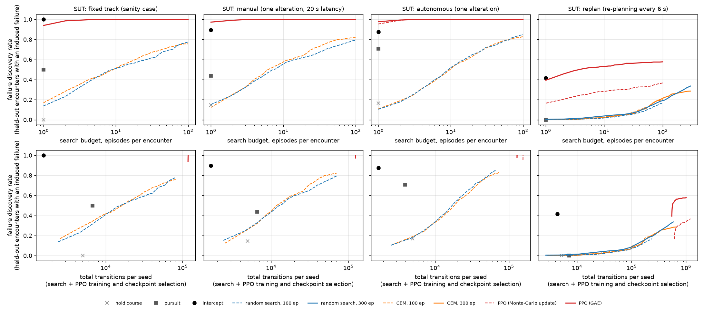

# Study runs 2026-10-08: improvement points rechecked, systems under test, method comparison

Date: 2026-10-08. Code: branch `worktree-study-plan-runs-2026-10-08` of this repository, folder `general/`. Run outputs (not in the repository): `Desktop/PPO_scenario_generate/runs/study_2026-10-08/` on the owner's machine.

This record answers one request: review the last Digitaltesting work, check the improvement points of `STUDY_PLAN_PEER_REVIEW.md` again against the code, and run a series to see the result. The work of 2026-09-24 had wired the data step into the environments and left the study design untouched, so every point of the plan was still open in the code on 8 October.

## 1. Improvement points, rechecked against the code

| # | Point (study plan section 1 and 5) | State in the code on 2026-10-08, before this work | Done now |
|---|---|---|---|
| 1 | No collision-avoidance controller under test | `EncounterAttackEnv` set `automation='fixed'` in its constructor and passed `'fixed'` to every `TargetShip`; the reactive presets existed but could not be reached | `--automation fixed\|manual\|autonomous\|replan`; the new preset `replan` (re-planning avoidance controller, section 2) |
| 2 | The benchmark saturates | confirmed again, section 3.1 | envelope series over attacker top speed and SUT; the study runs at the one setting that does not saturate |
| 3 | Comparisons lack power (3 seeds) | 3 seeds per configuration | 10 seeds per configuration; two-level bootstrap over seeds and encounters |
| 4 | Full and turn-only control confounded | unchanged | the study uses one capability setting (full control, 9 actions) and counts cost in transitions and 1 s sub-steps |
| 5 | Selection and test not separated | checkpoint selection and the scorecard both on seed + 1000 | selection on the training parameter intervals with seed 5000 + s; test on a fixed list of 48 encounters from the held-out intervals (seeds 20000 + i) |
| 6 | PPO rollout boundary | `PPO.update` reset the return to zero at the end of every 4000-transition buffer; the critic was fitted to the per-buffer normalised return | GAE(0.95) with the critic on the raw return scale and the value of the next state as bootstrap at a buffer end inside an episode; unit check; ablation in section 3.2 |
| 7 | Evaluation policy mismatch | selection sampled actions | selection and the first deployment attempt use the argmax policy |
| 8 | "Success" mixes domain infringement and collision | one flag | collision reported separately (share of induced failures that reach a collision) |
| 9 | 1152 scorecard episodes are not independent tests | aggregate only | one row per (seed, encounter); intervals resample both levels |
| 10 | Provenance | `args.json` lacked `control` | `args.json` holds every new flag; `env_config.json` holds the full environment (limits, standard, actions, SUT, split) |
| 3 (plan) | Random search and CEM at equal budget | absent | random search and the cross-entropy method (CEM) over a three-segment open-loop manoeuvre, at 100 and 300 episodes per encounter |
| 4 (plan) | Held-out parameter intervals | absent | `--param_split`: course difference, meeting time, initial DCPA and parallel-lane lag from the lower 70 % (train) or upper 30 % (test) of their ranges |
| 7 (plan) | Counterfactual replay and failure labels | absent | not done |

## 2. What changed in the code

- `attack_scenarios.py`: `automation` (the SUT), `param_split`, `encounter_list` (a fixed list of scenario name and encounter seed, replayed in order so every method attacks the same initial encounters), counters of environment transitions and 1 s simulator sub-steps, and the fields `automation`, `param_split`, `encounter_seed`, `substeps`, `collision`, `domain_violation`, `domain_held`, `target_evasions` in the episode record. With `param_split='all'` the draws are the original ones, so earlier runs reproduce; `check_attack_scenarios.py` gives the same baseline table as on 2026-09-15.
- `scenario_targets.py`: preset `replan`. Zero latency and no cooldown; while the danger criterion holds (range < 2000 m, DCPA < 300 m, 0 <= TCPA < 150 s, the `autonomous` thresholds) the target re-plans every 6 s and steers the starboard alteration of 0 to 90 deg (15 deg steps) off its route course that gives the largest predicted miss distance against the attacker's current velocity; it returns to the route after 10 s without danger. Course only, speed held, like the other presets.
- `PPO.py`: `gae_lambda` and `update(next_state)`. The default (`gae_lambda=None`) keeps the reference update, so the scripts that import it behave as before.
- `main_attack_ppo_enc.py`: `--automation`, `--param_split`, `--select_split`, `--select_seed`, `--advantage mc|gae`, `--gae_lambda`, `--eval_deterministic`, `--budget_transitions`; `eval_result.txt` also logs transitions, sub-steps and the collision rate; `env_config.json`.
- New: `study_compare.py` (methods on the common encounters, envelope series, report), `study_batch.py` (resumable process pool).

## 3. Results

Common setting of every run: eight attack scenarios (`mix`), DCPA band `passing` (holding course gives a safe passage, so the attacker has to create the danger), arena scale (ship length 35 m, ship domain 140 m x 56 m semi-axes, collision at 35 m centre distance), full control with 9 actions and 6 s decisions, target cruise speed 6 m/s. A failure of the SUT is the attack success of the environment: a ship-domain infringement sustained for two decisions, or a collision. The test set is one fixed list of 48 encounters (6 per scenario, seeds 20000 + i) drawn from the held-out parameter intervals; every method attacks exactly these encounters.

### 3.1 Envelope: where the benchmark saturates

Scripted attackers, one deterministic episode per held-out encounter, fraction of the 48 encounters with an induced failure (`envelope/envelope.csv`):

| SUT | attacker | speed ratio 1.0 (6 m/s) | 1.25 | 1.5 | 2.0 (12 m/s, earlier default) |
|---|---|---|---|---|---|
| fixed | intercept | 1.00 | 0.96 | 0.75 | 0.75 |
| manual | intercept | 0.90 | 0.96 | 0.81 | 0.77 |
| autonomous | intercept | 0.88 | 0.92 | 0.75 | 0.83 |
| replan | intercept | **0.42** | 0.85 | 0.88 | 0.85 |
| fixed | pursuit | 0.50 | 0.81 | 0.75 | 0.75 |
| manual | pursuit | 0.44 | 0.88 | 0.81 | 0.77 |
| autonomous | pursuit | 0.71 | 0.88 | 0.83 | 0.83 |
| replan | pursuit | **0.00** | 0.71 | 0.71 | 0.73 |

An attacker that can outrun the target (speed ratio 1.25 and above) induces a failure in 0.71 to 0.96 of the encounters against every SUT, `replan` included: a course-only avoidance controller cannot open the range to a faster pursuer. The two one-shot presets fail at every speed ratio, because after their single 30 or 45 deg alteration they return to the route once the danger criterion clears and the attacker re-aims (the mechanism found on 2026-09-15). The fall of the weak-SUT rates with speed ratio comes mainly from the parallel lanes, where a faster intercept overshoots a target abeam (fixed: parallel lanes 1.00 at ratio 1.0, 0.00 at 1.5 and 2.0, crossings and head-on 1.00 throughout). Only `replan` at equal speed resists a scripted attacker: intercept 0.42 (every port crossing, 0.67 of the head-on encounters, no starboard crossing and no parallel lane), pursuit 0.00. The comparison therefore runs at speed ratio 1.0 against all four SUTs; `fixed`, `manual` and `autonomous` are kept as sanity cases.

### 3.2 PPO training: 60 runs, and the effect of the update fix

3000 episodes per run, training parameter intervals, dense reward, checkpoint selection every 250 episodes on 48 encounters of the training intervals (seed 5000 + s) with the argmax policy. Selection score = fraction of those 48 encounters with an induced failure; mean +- standard deviation over 10 seeds; difference with a bootstrap 95 % interval over seeds.

| SUT | update | best selection score | mean of the last 3 evaluations | episodes to 0.9 | training transitions per run |
|---|---|---|---|---|---|
| fixed | GAE | 1.000 +- 0.000 | 1.000 | 600 (10/10) | 99 k |
| manual | GAE | 1.000 +- 0.000 | 1.000 | 650 (10/10) | 104 k |
| autonomous | GAE | 0.998 +- 0.007 | 0.994 | 750 (10/10) | 109 k |
| autonomous | Monte-Carlo (reference) | 0.992 +- 0.026 | 0.967 | 950 (10/10) | 131 k |
| replan | GAE | 0.590 +- 0.212 | 0.541 | never (0/10) | 452 k |
| replan | Monte-Carlo (reference) | 0.306 +- 0.203 | 0.244 | never (0/10) | 501 k |

The update fix matters on the one SUT that resists: GAE minus the reference update is +0.28 [+0.11, +0.45] on the best selection score and +0.30 [+0.12, +0.46] on the last three evaluations against `replan`. Against `autonomous` both updates saturate; GAE gets there in 750 instead of 950 episodes and ends steadier (+0.027 [+0.005, +0.053] on the last three evaluations). The mean GAE learning curve against `replan` still rises at 3000 episodes (0.47, 0.51, 0.54, 0.57 at 2250 to 3000), so the PPO numbers against `replan` below are those of an unconverged policy.

### 3.3 Comparison on the 48 held-out encounters

Failure discovery rate = fraction of the 48 held-out encounters in which the method induced a failure within its budget, averaged over seeds; 95 % interval from a two-level bootstrap (encounters resampled jointly, seeds resampled per method; Wilson interval for the single-seed scripted methods). "First attempt" = rate within one episode per encounter (the argmax episode for PPO). "Collision share" = share of the induced failures that reached a collision before the domain infringement had been held for two decisions. Cost = environment transitions per seed: the search itself plus, for PPO, the whole training run and every checkpoint-selection evaluation.

**SUT `replan`** (the only setting where scripted attackers stay below saturation). Rows with "<= N" give the method up to N episodes per encounter; the PPO rows at 1 and 10 episodes are the same deployments read at a smaller budget, and their cost is approximate (attempts x mean transitions per attempt of each encounter).

| method | episodes per encounter | failure discovery rate [95 %] | first attempt | collision share | transitions per seed |
|---|---|---|---|---|---|
| hold course | 1 | 0.00 [0.00, 0.07] | 0.00 | | 5 k |
| pursuit | 1 | 0.00 [0.00, 0.07] | 0.00 | | 7 k |
| intercept | 1 | 0.42 [0.29, 0.56] | 0.42 | 0.50 | 4 k |
| random search | <= 100 | 0.17 [0.10, 0.25] | 0.00 | 0.05 | 240 k |
| random search | <= 300 | 0.34 [0.24, 0.44] | 0.00 | 0.13 | 585 k |
| CEM | <= 100 | 0.20 [0.13, 0.29] | 0.00 | 0.19 | 243 k |
| CEM | <= 300 | 0.29 [0.20, 0.38] | 0.00 | 0.07 | 673 k |
| PPO (GAE) | 1 (argmax) | 0.39 [0.22, 0.57] | 0.39 | | 549 k (approx.) |
| PPO (GAE) | <= 10 | 0.53 [0.35, 0.71] | 0.39 | | 595 k (approx.) |
| PPO (GAE) | <= 100 | 0.58 [0.40, 0.76] | 0.39 | 0.09 | 1007 k |
| PPO (Monte-Carlo) | 1 (argmax) | 0.17 [0.07, 0.26] | 0.17 | | 611 k (approx.) |
| PPO (Monte-Carlo) | <= 100 | 0.37 [0.20, 0.55] | 0.17 | 0.11 | 1209 k |

PPO cost per seed against `replan` = 452 k training + 90 k checkpoint selection (GAE; 501 k + 103 k for the Monte-Carlo update) + the deployment itself.

Paired differences at a matched total budget of about 0.6 M transitions per seed (two-level bootstrap, 95 %; `compare/matched_pairs.csv`, `compare/paired_bootstrap.csv`):

| comparison | difference |
|---|---|
| PPO (GAE) <= 10 minus CEM <= 300 | +0.25 [+0.04, +0.45] |
| PPO (GAE) <= 10 minus random search <= 300 | +0.20 [-0.04, +0.41] |
| PPO (GAE) argmax minus random search <= 300 | +0.06 [-0.15, +0.26] |
| PPO (GAE) argmax minus intercept | -0.02 [-0.24, +0.19] |
| PPO (GAE) <= 10 minus intercept | +0.12 [-0.11, +0.32] |
| CEM <= 300 minus random search <= 300 | -0.05 [-0.15, +0.05] |
| PPO (GAE) <= 100 minus PPO (Monte-Carlo) <= 100 | +0.21 [-0.02, +0.45] |

Failure discovery rate per encounter family against `replan` (12 encounters per family):

| method | port crossing | starboard crossing | head-on | parallel lanes |
|---|---|---|---|---|
| intercept | 1.00 | 0.00 | 0.67 | 0.00 |
| random search <= 300 | 0.21 | 0.02 | 0.76 | 0.36 |
| CEM <= 300 | 0.48 | 0.01 | 0.51 | 0.14 |
| PPO (GAE) <= 100 | 0.94 | 0.70 | 0.41 | 0.26 |
| PPO (Monte-Carlo) <= 100 | 0.66 | 0.32 | 0.38 | 0.11 |

The methods find different failures: PPO takes the crossings, random search the head-on encounters and the parallel lanes.

PPO (GAE) per seed against `replan`: selection score on the training intervals, held-out rate with the argmax episode and with up to 100 episodes.

| seed | 1 | 2 | 3 | 4 | 5 | 6 | 7 | 8 | 9 | 10 |
|---|---|---|---|---|---|---|---|---|---|---|
| selection (training intervals) | 0.75 | 0.52 | 0.25 | 0.75 | 0.83 | 0.60 | 0.29 | 0.44 | 0.62 | 0.83 |
| held-out, argmax | 0.71 | 0.25 | 0.08 | 0.62 | 0.73 | 0.29 | 0.02 | 0.12 | 0.54 | 0.56 |
| held-out, <= 100 episodes | 0.75 | 0.50 | 0.23 | 0.75 | 0.90 | 0.77 | 0.21 | 0.19 | 0.75 | 0.73 |

Three seeds (3, 7, 8) stay near 0.2 on the held-out encounters while seven reach 0.5 to 0.9; this spread (standard deviation 0.27) is the largest source of uncertainty in the PPO rows. The selection score predicts the held-out argmax rate closely (correlation 0.94; 0.81 for the Monte-Carlo update), so a weak seed is recognisable before deployment. The mean selection score (0.59) lies above the held-out argmax rate (0.39); the gap mixes the optimism of keeping the best of 12 evaluations with the shift to the held-out intervals.

Weak SUTs (search budget 100 episodes per encounter, 10 seeds; scripted methods one episode):

| SUT | method | failure discovery rate | first attempt | collision share | transitions per seed |
|---|---|---|---|---|---|
| fixed | intercept | 1.00 [0.93, 1.00] | 1.00 | 0.65 | 1.6 k |
| fixed | random search | 0.78 [0.68, 0.87] | 0.14 | 0.22 | 80 k |
| fixed | CEM | 0.76 [0.64, 0.86] | 0.17 | 0.20 | 85 k |
| fixed | PPO (GAE) | 1.00 [1.00, 1.00] | 0.94 | 0.22 | 118 k |
| manual | intercept | 0.90 [0.78, 0.96] | 0.90 | 0.77 | 1.7 k |
| manual | random search | 0.79 [0.68, 0.89] | 0.15 | 0.17 | 71 k |
| manual | CEM | 0.82 [0.72, 0.91] | 0.12 | 0.17 | 70 k |
| manual | PPO (GAE) | 1.00 [1.00, 1.00] | 0.97 | 0.34 | 124 k |
| autonomous | intercept | 0.88 [0.75, 0.94] | 0.88 | 0.79 | 1.7 k |
| autonomous | random search | 0.85 [0.76, 0.93] | 0.10 | 0.21 | 66 k |
| autonomous | CEM | 0.83 [0.73, 0.92] | 0.11 | 0.19 | 74 k |
| autonomous | PPO (GAE) | 1.00 [1.00, 1.00] | 0.98 | 0.42 | 129 k |
| autonomous | PPO (Monte-Carlo) | 1.00 [1.00, 1.00] | 0.95 | 0.30 | 156 k |

Against the weak SUTs every method induces failures in most encounters, and a scripted intercept does it in one episode at about 1/70 of PPO's cost. CEM and random search do not differ (paired differences -0.02 to +0.03, every interval contains 0). These SUTs give no basis for ranking failure generators.

Figure: failure discovery rate on the 48 held-out encounters per SUT (columns). Top row against the search budget in episodes per encounter, bottom row against the total transitions per seed, PPO training and checkpoint selection included (search spend up to a budget is approximated by attempts x mean transitions per attempt of each encounter). Markers: scripted methods, one episode.

### 3.4 How the PPO attacker induces failures against `replan`

Two replays explain the starboard crossings, where PPO (GAE) reaches 0.70 over its 10 seeds and every other method at most 0.02. The first replay uses seed 1, the second seeds 1 and 5, two of the stronger seeds (held-out rates 0.75 and 0.90), so they describe what a successful policy does.

Replay of the 12 held-out starboard crossings, PPO seed 1 (argmax) and the scripted intercept, means per episode:

| attacker | outcome | decisions | min / mean speed [m/s] | largest course change [deg] | target re-plans | closest centre distance [m] |
|---|---|---|---|---|---|---|
| intercept | 12 x unresolved (safety cap) | 258 | 6.0 / 6.0 | 52 | 96 | 300 |
| PPO (GAE) | 12 x domain infringement | 110 | 5.4 / 6.0 | 73 | 40 | 113 |

Geometry at the first decision with severity >= 2, for every successful PPO episode of seeds 1 and 5 (69 episodes): the target's danger criterion is set and it is executing an evasive alteration in every crossing and head-on case (parallel lanes: evading in all 6, danger criterion set in 4). In the starboard crossings (23 episodes) the attacker sits in the target's stern sector in 15 cases (relative bearing 121 to 165 deg from the target's heading, mostly on its port quarter), on a near-parallel course (course difference -54 to +12 deg), closing at 0.9 to 5.5 m/s (mean 2.6), at a centre distance of 89 to 138 m, inside the 140 m along-course semi-axis of the target's domain; 7 cases are ahead of the target and 1 abeam. The port crossings split evenly between stern sector (8), ahead (8) and abeam (5). Head-on infringements happen ahead of the target in 12 of 19 cases (bearing within 65 deg of its heading) at 9.2 to 11.7 m/s closing speed and 43 to 131 m, the other 7 abeam.

Reading. The scripted intercept holds a lead-pursuit course at the speed cap; `replan` answers every re-aim with the starboard alteration that keeps the predicted miss distance at its 300 m alert threshold, and the stern chase at equal speed runs to the safety cap. The PPO attacker gives up speed for a short time, falls into the target's port quarter and closes slowly on a near-parallel course; from that sector, starboard alterations of up to 90 deg off the route course cannot open the range when both ships sail at the same speed, and the target's domain is infringed from astern. In COLREG terms an approach from more than 22.5 deg abaft the beam makes the attacker the overtaking, give-way vessel (Rule 13). These events are ship-domain infringements of the SUT that the attacker forced; whether the SUT could have prevented them (a speed increase or a port alteration, both outside its action set) is the attribution question of study-plan item 7, which this series has not run. For the SUT the replays point to two candidate extensions: a speed response and a rule for a threat in its stern sector.

## 4. What the results allow (study plan section 6)

**The one-shot presets are sanity cases only.** `manual` and `autonomous` fail against a scripted intercept in 0.88 to 0.90 of the held-out encounters at equal speed, and a scripted attacker that can outrun the target reaches 0.71 to 0.96 against every SUT. On these SUTs a ranking of failure generators measures the benchmark's saturation.

**Against the re-planning controller at equal speed, the ranking is partly established.**

- PPO (GAE) finds more failures per total budget than CEM: +0.25 [+0.04, +0.45] at about 0.6 M transitions per seed.
- Against random search the advantage at matched budget is +0.20 [-0.04, +0.41]: likely, and unresolved with 10 seeds.
- The scripted intercept reaches the level of PPO's argmax policy (0.42 against 0.39) at about 1/125 of the cost; PPO's lead over it with 10 sampled episodes (+0.12 [-0.11, +0.32]) is unresolved too.
- The study plan's first claim ("an RL adversary is an efficient failure generator for simplified reactive avoidance controllers") therefore holds against CEM and stays open against random search and a scripted closed-loop attacker.

**Amortisation (the plan's second claim) holds in the form the costs show.** PPO pays about 0.54 M transitions per seed before deployment (training and checkpoint selection). After that, a new encounter costs one argmax episode (about 155 transitions, 0.39) or up to ten sampled episodes (about 1.1 k transitions, 0.53), against about 12 k transitions per encounter for random search with up to 300 episodes (0.34). The two costs break even at about 45 to 50 encounters; the test set has 48, which is why the totals come out similar. Beyond that, the per-encounter cost decides, provided the discovery rate holds on new encounters.

**CEM over the three-segment open-loop manoeuvre adds nothing over random search** on any SUT (differences -0.05 to +0.04, every interval contains 0). An open-loop manoeuvre cannot answer a target that re-plans every 6 s, and against `replan` almost every sample ends without a failure (first-attempt rate 0.00), so the elite samples that drive the CEM update differ from the others only through the miss distance.

**The PPO update fix is required for this study.** With the reference Monte-Carlo update the selection score against `replan` halves (0.31 against 0.59) and the held-out argmax rate drops from 0.39 to 0.17.

**The failures PPO induces against `replan` need attribution before they count as SUT failures.** In the starboard crossings most infringements come from the target's stern sector at low closing speed, a geometry in which the attacker is the overtaking vessel under Rule 13. The counterfactual replay of study-plan item 7 decides how many of these the SUT could have prevented.

**Seed dispersion dominates the PPO uncertainty.** Three of ten seeds stay near 0.2. The selection score identifies them (correlation 0.94 with the held-out argmax rate), so a protocol that trains several seeds and deploys the best by selection score is possible; its training cost multiplies with the number of seeds and must enter the budget.

## 5. Limits of this series

- One discriminating setting: `replan` at speed ratio 1.0. The envelope shows that a faster attacker defeats every course-only SUT, so the result covers equal speeds only.
- The SUT presets are simplified: course alterations to starboard only, speed held, no use of COLREG roles. `replan` returns to its route 10 s after the danger clears and re-enters evasion often (22 to 26 evasion starts per episode against the scripted attackers).
- PPO against `replan` is unconverged at 3000 episodes (mean selection curve still rising).
- A failure is a ship-domain infringement held for two decisions or a collision. Episodes end at the first such event, so the collision shares are lower bounds; a collision-only objective (`--success_severity 3`) was not run.
- The search baselines are open-loop. A closed-loop parametric attacker (for example an intercept with a lead angle and a speed schedule, tuned by CEM) is the stronger optimisation baseline a reviewer will ask for.
- PPO costs at 1 and 10 episodes per encounter are approximated from attempts x mean transitions per attempt.
- The held-out intervals are the upper 30 % of each parameter range. They were set by fraction, without reference to the owner's private AIS encounter statistics.
- Not done: counterfactual replay and failure labels (plan item 7), rliable IQM, `check_env_wiring.py` in the worktree (it needs the gitignored synthetic data; the route chain was not touched).
- Run incident: the 20 parallel PPO deployment workers grew to about 0.8 GB each, because sampled actions were stored in the rollout buffer and never cleared, and Claude Code stopped the batch under memory pressure. The 7 unfinished jobs (`replan`, PPO seeds) were re-run with the buffer cleared after every episode. The buffer never fed back into action selection, so the 13 earlier results are unaffected. A preliminary reading of the 13 jobs that had finished first (PPO GAE 0.74 against `replan`) was biased upward: the slow jobs were the weak seeds.

## 6. Next steps, in order

1. Train PPO against `replan` longer (the curve still rises at 3000 episodes), for example 9000 episodes x 10 seeds, about 2.5 h on 10 cores, with `study_batch.py` after raising `--episodes`.
2. Counterfactual replay and attribution of the `replan` failures (plan item 7), with the COLREG role of the attacker at the event (overtaking, crossing, head-on) as a recorded field. Done the same day for every event of the study: `EVENT_MARKING_2026-10-08.md` (no event is inescapable; PPO's events leave the SUT the fewest escape options among the learned and searched methods).
3. A closed-loop parametric search baseline (intercept family with lead angle and speed schedule, tuned by CEM) on the same 48 encounters and budget.
4. A stronger SUT: `replan` with a speed response and a stern-sector rule; and the speed ratios 1.05 to 1.2 to locate where the re-planner stops resisting.
5. A collision-only run, and held-out intervals set from the private AIS encounter statistics (owner, locally).

## 7. Files

Repository (`general/`): `attack_scenarios.py`, `scenario_targets.py`, `PPO.py`, `main_attack_ppo_enc.py` (changed), `study_compare.py`, `study_batch.py` (new); this record and `review/figures/study_2026-10-08_budget_curves.png`.

Run folder (owner's machine, `Desktop/PPO_scenario_generate/runs/study_2026-10-08/`): `ppo/<sut>_<update>_s<seed>/` (60 training runs with `args.json`, `env_config.json`, logs and checkpoints), `compare/<sut>/*.csv` (one row per seed and encounter), `compare_b300/replan/*.csv`, `compare/summary.csv`, `paired_bootstrap.csv`, `matched_budget.csv`, `matched_pairs.csv`, `summary.md`, `budget_curves.png`, `envelope/envelope.csv`, batch logs.

Reproduce: `python study_batch.py train|compare|report --root <dir>`, `python study_batch.py search --root <dir> --sut replan --methods random,cem --budget 300`, `python study_compare.py envelope --out <dir>/envelope`.
